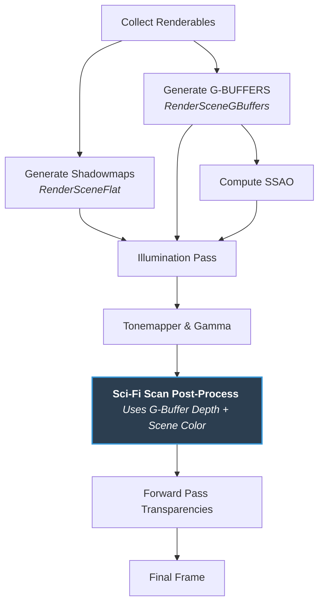

# Technical Report: Death Stranding Terrain Scanner Effect in a Deferred rendering Pipeline

**Course Project Technical Documentation**  
**Topic:** Screen-Space Post-Processing Sci-Fi Terrain Scanner  
**Implementation Framework:** C++ Custom OpenGL Rendering Engine (`GTRFrameworkStudent`)

---

## 1. Introduction & Abstract

In modern real-time graphics, rendering volumetric scan waves that interact organically with complex environments is a recurring aesthetic goal (popularized by titles such as *Death Stranding* and *Metroid Prime*). Rather than implementing a simple geometric shell, our objective was to design a highly sophisticated, multi-layered visual effect that propagates through the environment, highlighting topographic contours and digitizing the terrain.

This report documents the implementation of a post-processing **Sci-Fi Terrain Scanner** integrated into a deferred rendering pipeline. The effect is mathematically reconstructed in world-space using G-Buffer depth data, dynamically shaded with custom holographic scan-line equations, enhanced for high legibility via Photoshop-style blending techniques, and refined with a trailing fade-out profile. Furthermore, a custom playback and pause controller has been implemented in the CPU rendering engine to facilitate debugging and visual analysis.

---

## 2. Deferred Pipeline Integration & Architecture

The framework utilizes a **Deferred Rendering Pipeline** to decouple lighting computation from geometry complexity. Integrating our screen-space post-processing scan effect required careful consideration of the rendering sequence to ensure proper interaction with shadows, ambient occlusion (SSAO), tonemapping, and transparent objects.

### 2.1 The Render Pipeline Sequence
The diagram below illustrates the exact structure of our rendering pipeline and highlights where the **Sci-Fi Scan Post-process** is injected:



### 2.2 Integration Rationale
1. **Post-Tonemapping Placement:** The scan is applied directly onto the color buffer after the HDR Tonemapper and Gamma Correction (`illumination_fbo` color texture). This ensures that the bright holographic lines and edge emissions preserve their exact HSL color properties (e.g., pure white leading line, vibrant holographic blue) without being clamped or color-shifted by the tonemapping curve.
2. **Pre-Transparency Placement:** Transparent entities (such as windows, particles, or glass) are rendered after the post-processing pass directly onto the final viewport using a forward pass with alpha blending. This prevents the scanner from treating glass or particles as solid surfaces, meaning the holographic lines do not project onto empty air or transparent materials incorrectly.
3. **G-Buffer Depth Dependency:** The post-processing shader reads the raw depth texture (`gbuffer_fbo->depth_texture`) to reconstruct the exact world-space coordinates of every pixel, which is essential to make the lines wrap around the 3D terrain.

---

## 3. Mathematical & Shading Layer Breakdown

To achieve a visually stunning, premium-tier look, the scanner combines several layers of mathematical shading. Below is the technical breakdown of each layer's equations and implementations.

### Layer 1: World-Space Position Reconstruction
To anchor the holographic lines to the terrain and prevent them from warping, sliding, or stretching when the camera moves or rotates, we reconstruct the exact **World-Space Coordinate** ($P_w$) of every pixel.

Using the screen-space UV coordinates ($u, v$) and the raw depth value ($d \in [0, 1]$) sampled from the G-Buffer depth buffer, we transform the pixel back into Normalized Device Coordinates (NDC) in Clip Space:
$$P_{ndc} = \begin{bmatrix} 2u - 1 \\ 2v - 1 \\ 2d - 1 \\ 1 \end{bmatrix}$$

We then multiply by the inverse View-Projection matrix ($M_{VP}^{-1}$) and perform perspective division:
$$P_{clip} = M_{VP}^{-1} \cdot P_{ndc}$$
$$P_w = \frac{P_{clip}.xyz}{P_{clip}.w}$$

This reconstruction runs per-pixel in our fragment shader, providing a highly stable, crisp coordinate space for distance-based calculations.

---

### Layer 2: High-Contrast Ambient Ground Darkening (Darken Blend)
Holographic projections (blue and white lines) suffer from legibility issues when drawn over highly bright or detailed textures (such as snow or grass). To address this, we implemented an ambient ground-darkening pass utilizing the Photoshop **Darken Blend** formula.

In simple terms, if you project a bright blue holographic line onto bright white snow or bright green grass, the line completely washes out and becomes invisible. To make the lines stand out ("pop"), we need to darken the ground under the scanner. However, simply multiplying the color to darken it would make already-dark details pitch black and muddy. Instead, we use the Photoshop "Darken" blend mode: for every pixel, the shader compares the original ground color with an ultra-dark navy blue. If the ground is already dark, it leaves it alone, preserving the texture details. If the ground is bright, it caps it and replaces it with the dark navy blue. This creates a uniform, dark canvas where the bright holographic lines are extremely easy to see.

Mathematically, we evaluate the minimum channel-by-channel value between the original scene color ($C_{scene}$) and our ultra-dark navy blue color ($C_{darken} = (0.02, 0.05, 0.12)$):
$$C_{blended} = \min(C_{scene}, C_{darken})$$

This is then interpolated based on our scanner area mask ($M_{scan}$) and the darkening strength ($S_d = 0.85$):
$$C_{working} = \text{mix}(C_{scene}, C_{blended}, M_{scan} \cdot S_d)$$

This ensures that under the active scanner, dark channels are preserved, but all bright channels are capped, providing massive contrast for the glowing lines to "pop" on screen.

---

### Layer 3: The Wave Front Edge Gradient
To simulate the physical friction of energy rolling over the terrain, the leading edge of the wave is highlighted using a smooth emission gradient.

In simple terms, this layer represents the visual "glow" at the very front of the scanner wave (the bright cyan band in your image). To build this, the shader splits the calculation into two logical parts:
1. **The `gradient` (The smooth fade-in):** We use a `smoothstep` curve that goes smoothly from `0.0` (at 0.8 meters behind the front) up to `1.0` (exactly at the front). However, a limitation of `smoothstep` is that for any distance *greater* than the front, it stays at `1.0` forever, which would make the entire unscanned map glow.
2. **The `step` (The hard cut-off):** To stop the glow from bleeding outside, we use a binary `step` that is `1.0` inside the wave radius and drops instantly to `0.0` outside it.

By multiplying these two terms together ($\text{mask}_{edge} = \text{gradient} \cdot \text{step}$), we get a perfect "sawtooth" profile: the glow builds up smoothly from $0.0$ to $1.0$, and the exact millisecond you cross the front border, it is multiplied by $0.0$, cutting off instantly. This creates a crisp, glowing boundary wave.

Mathematically, the gradient is calculated based on the distance $dist$ from the scan origin:
$$\text{gradient} = \text{smoothstep}(R_{scan} - W_{edge}, R_{scan}, dist)$$

Where $R_{scan}$ is the current scanner radius and $W_{edge} = 0.8$ meters is the edge width. The gradient is then multiplied by an `insideRadius` binary step to prevent the emission from bleeding outside the active wave boundary:
$$\text{mask}_{edge} = \text{gradient} \cdot \text{step}(dist, R_{scan})$$

This creates a sharp cut-off at the front edge and a smooth fade backwards, simulating an expanding energy wall.

---

### Layer 4: Glowing Topographic Scan Lines (The Grid)
This is the core holographic element. Standard implementations often use a flat step function, resulting in thick, blocky, binary lines that look cheap and lack volume. To achieve a modern, premium look, we designed a **symmetric glowing line profile** utilizing a smooth mathematical envelope.

In simple terms, this layer draws the concentric, blue holographic grid lines that appear on the ground behind the expanding wave front (the blue curve on the right side of your image). To make these lines look like a professional, high-end effect, we implemented two key improvements:
- **Dynamic Line Spacing:** Instead of keeping the lines at exactly the same distance forever, we increase the gap between them by 3% for every meter of distance from the player. Close to the player, the lines are tight and detailed, but far away, they spread out. This prevents the lines from merging into a solid, messy blue blur at the horizon due to perspective, creating a grand sense of depth.
- **Symmetric Soft Glow:** Instead of drawing harsh, solid-colored stripes, we mathematically center a smooth glow. The brightness peaks exactly in the middle of each line and fades out smoothly to both sides. This makes each line look like a real, soft laser beam projected onto the terrain.

Mathematically, this is achieved through three equations:
1. **Dynamic Interval Spacing:** To prevent visual clutter at far distances, the spacing between lines increases exponentially relative to the distance from the origin ($dist$):
   $$I_{dynamic} = I_{base} \cdot (1.0 + dist \cdot 0.03)$$
   This spreads the lines further apart as they move away, giving a dramatic sense of scale.
2. **Fractional Distance Repetition:** We repeat the lines infinitely by taking the fractional part of the distance:
   $$D_{frac} = \text{fract}\left(\frac{dist}{I_{dynamic}}\right) \cdot I_{dynamic}$$
3. **Symmetric Glowing Gradient:** Instead of a harsh binary cut-off, we center a smooth peak inside the line width ($W_{line}$):
   $$D_{center} = \left| D_{frac} - \frac{W_{line}}{2} \right|$$
   $$\text{lineMask} = \text{smoothstep}\left(\frac{W_{line}}{2}, 0.0, D_{center}\right)$$

This yields a gorgeous glowing line profile where intensity peaks precisely in the middle and decays in a smooth cubic S-curve towards both edges, replicating real laser projections.

---

### Layer 5: The Dual-Color Visual Cue (The White Leading Line)
To guide the player's eye and emphasize the direction of the wave, the absolute foremost scan line (closest to the front) is rendered in bright white, while all subsequent interior tracking lines are rendered in blue. We achieve this by calculating the distance from the leading edge ($distFromEdge = R_{scan} - dist$). If this distance falls within the first spacing interval ($I_{dynamic}$), we isolate it as the first ring ($\text{isFirstRing} = \text{step}(0.0, distFromEdge) \cdot \text{step}(distFromEdge, I_{dynamic})$). By multiplying our lines mask by this detection factor, we separate the grid into two emission terms: the white **Leading Line** ($\text{lineMask} \cdot \text{isFirstRing}$) and the blue **Interior Lines** ($\text{lineMask} \cdot (1.0 - \text{isFirstRing})$). This creates a highly intuitive visual cue where a distinct white ring leads the scan, leaving a trailing tail of blue diagnostic data behind it.

---

## 4. Design Refinements & Trailing Dissipation (Fase 2)

During initial testing, we identified a critical visual defect: both the ground darkening and the interior blue scan lines remained visible forever inside the scanned radius, creating massive visual noise and cluttering the terrain long after the wave front had passed.

To solve this, we implemented a physical **Trailing Fade-out (Trailing Dissipation)**:

```
                  <-- DIRECTION OF EXPANSION <--
[ Clean Ground ]  [========= Trailing Fade-out =========]  [ Wave Front ]  [ Unscanned ]
   dist = 0m      dist = R_scan - u_trail_width            dist = R_scan    dist > R_scan
  trailMask = 0          trailMask: 0.0 -> 1.0             trailMask = 1    insideMask = 0
```

1. **Trail Envelope:** We introduced a new uniform, `u_trail_width` (defaulting to `12.0` meters), representing the active dissipation zone behind the front.
2. **Trail Mask Calculation:** Per pixel, we calculate a smooth trailing mask:
   $$\text{trailMask} = \text{smoothstep}(R_{scan} - W_{trail}, R_{scan}, dist)$$
3. **Application:** We multiply both the darkening blend mask and the lines emission mask by this `trailMask`. 

As the scanner expands, the ground darkening and the holographic lines behind the active zone dissolve smoothly, returning the terrain to its original shaded appearance. This completely removes visual noise and creates a premium, clean dissipation wave.

---

## 5. Timeline Control & Interactive Presentation Tools

To present this effect in class, we decoupled the temporal update loop from the global frame clock, implementing a **local time accumulator** ($t_{local}$) driven by local frame delta-times ($dt$). We exposed these parameters in ImGui to provide two highly useful debug modes:

1. **Automatic Mode (with Play/Pause):** The scan propagates according to our 3-phase physics curve:
   - **Phase 1: Charge (0s - 0.5s):** Rapid contraction of an ultra-dark circle around the player, simulating energy concentration.
   - **Phase 2: Pause (0.5s - 0.8s):** Brief freeze at a radius of 2.0 meters, creating visual anticipation.
   - **Phase 3: Expansion (0.8s+):** Instant velocity burst outward with exponential decay (using $1 - e^{-k t_{local}}$) simulating energy dissipation, followed by a final fade-out.
   - *Interactive Control:* A **Pausar / Reanudar (Play/Pause)** button freezes the accumulator in mid-expansion, allowing the presenter to rotate the camera and showcase the world-space reconstruction while frozen.
2. **Manual Mode (Timeline Scrubbing):** By checking the "Modo Manual" box in ImGui, the automatic clock is disabled, and a **Línea de Tiempo (s)** slider appears. Dragging this slider lets the presenter scrub through the scan animation back and forth like a video player, displaying the exact phase behaviors in slow motion.
3. **Real-time Parameters:** Desliders for **Largo del Rastro (m)** (`scan_trail_width`) and individual visual parameters allow fine-tuning the look on different scene sizes in real time.

---

## 6. Implementation Analysis & Evaluation

### Pros (Advantages)
- **Pixel-Perfect Geometry Adaptation:** Because the Sobel-like math operates on the reconstructed depth buffer, the scan lines perfectly contour complex meshes (rocks, trees, car chassis) and individual foliage elements without any polygon intersecting artifacts.
- **Resolution-Independent Geometry Cost:** Being a full-screen post-processing shader, the rendering performance is entirely independent of the scene's polygon count. It scales solely with the screen's pixel resolution (fill-rate bound).
- **Infinite Ground Stability:** Using world-space coordinates reconstructed from the camera matrices ensures that the scan lines remain 100% stable on the terrain. They do not drift or warp during camera translation or rotation.

### Cons (Limitations & Challenges)
- **Skybox Artifacts:** Reconstructing world position from depth values near 1.0 (skybox) yields extreme or infinite coordinates, causing numerical instability. An early exit depth comparison ($d \geq 0.9999$) is mandatory to bypass the skybox.
- **Occluded Areas:** Since G-Buffer depth only represents the first visible surface, any geometry that is completely occluded by foreground obstacles will not receive scan lines. However, this behaves naturally as a "visual shadow", which fits the sci-fi scanner theme.
- **Lack of Physical Collisions:** Being purely visual in the shader, the wave expansion cannot trigger game logic triggers (e.g. tagging an enemy or item) directly without writing a parallel CPU-side distance evaluation loop.

### Future Work
1. **Directional Cone Masking:** Incorporate a dot product mask using the player's forward vector to restrict the expansion to a 120-degree wedge, rather than a full 360-degree sphere.
2. **Mesh Edge Highlighting (Sobel Operator):** Integrate a screen-space Sobel filter on the G-Buffer normals and depth within the scan radius to draw high-tech cybernetic outlines around rock and prop silhouettes, enhancing the digitizing aesthetic.
